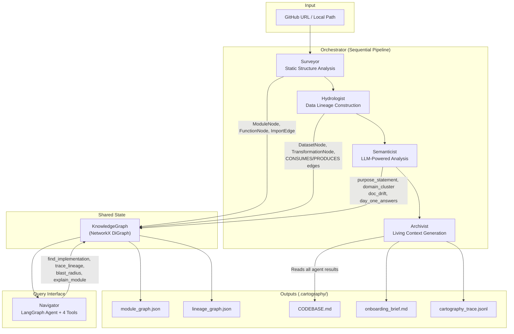

# The Brownfield Cartographer — Final Report

**Author:** Yonas Mekonnen  
**Date:** March 14, 2026  
**Target Codebase:** [dbt-labs/jaffle_shop](https://github.com/dbt-labs/jaffle_shop) — A canonical dbt demo project modeling an e-commerce store's order management pipeline.

---

## 1. Manual Reconnaissance — Day-One Analysis

### Target Codebase Overview

The **jaffle_shop** project is a dbt (data build tool) project that transforms raw e-commerce data (customers, orders, payments) through a staging → mart architecture. It contains 8 source files: 5 SQL models, 2 YAML schema files, and 1 `dbt_project.yml` configuration.

### Five FDE Day-One Questions

#### Q1: What is the primary data ingestion path?

**Answer:** Data enters through three raw seed tables — `raw_customers`, `raw_orders`, and `raw_payments` — which are loaded via dbt's `seeds/` mechanism. These are the only external data inputs. Each raw table feeds exactly one staging model:

| Source          | Staging Model                      | Evidence                                 |
| --------------- | ---------------------------------- | ---------------------------------------- |
| `raw_customers` | `models/staging/stg_customers.sql` | `SELECT ... FROM raw_customers` (line 5) |
| `raw_orders`    | `models/staging/stg_orders.sql`    | `SELECT ... FROM raw_orders` (line 9)    |
| `raw_payments`  | `models/staging/stg_payments.sql`  | `SELECT ... FROM raw_payments` (line 7)  |

This is a textbook **fan-in** pattern: three independent sources converging through staging to two mart outputs.

#### Q2: What are the 3–5 most critical output datasets/endpoints?

**Answer:** The project has exactly **2 terminal outputs** (mart-layer tables):

1. **`customers`** (`models/customers.sql`) — Customer 360 view aggregating first/last order dates, order counts, and lifetime value. This is the highest-complexity model with 4 CTEs and a multi-way join.
2. **`orders`** (`models/orders.sql`) — Enriched order records with payment method breakdowns (credit card, coupon, bank transfer, gift card amounts). Uses a pivot pattern on `stg_payments`.

Both are materialized as `table` via the project-level `dbt_project.yml` setting (`+materialized: table` for the `marts` folder). The staging layer uses `view` materialization.

#### Q3: What is the blast radius if the most critical module fails?

**Answer:** The most critical module is **`models/orders.sql`** because:

- It is consumed by `models/customers.sql` (via `orders` CTE at line 11)
- Its failure would cascade: both `orders` and `customers` tables would fail to build
- This means **100% of mart outputs** would be unavailable
- Evidence: `customers.sql` line 11: `orders as (select * from {{ ref('orders') }})`

If **`stg_payments.sql`** fails instead, the blast radius is identical — it feeds `orders.sql`, which feeds `customers.sql`. The payment staging model is the single point of failure for the entire financial dimension.

#### Q4: Where is the business logic concentrated vs. distributed?

**Answer:** Business logic is concentrated in the mart layer, not distributed:

| Layer                                     | Logic Type                                               | Evidence                                                                                                            |
| ----------------------------------------- | -------------------------------------------------------- | ------------------------------------------------------------------------------------------------------------------- |
| **Staging** (`stg_*.sql`)                 | Pure renaming + type casting — no business logic         | `stg_customers.sql`: just `SELECT id as customer_id, first_name, last_name`                                         |
| **Marts** (`customers.sql`, `orders.sql`) | Aggregations, pivots, joins, lifetime value calculations | `customers.sql`: 4 CTEs computing `first_order`, `most_recent_order`, `number_of_orders`, `customer_lifetime_value` |
| **Config** (`schema.yml`)                 | Data quality constraints (NOT NULL, accepted_values)     | `orders.status` constrained to `['placed', 'shipped', 'completed', 'return_pending', 'returned']`                   |

This is a well-designed separation of concerns: staging is "clean but don't transform," marts are "transform and aggregate."

#### Q5: What has changed most frequently in the last 90 days (git velocity)?

**Answer:** Using `git log --since="90 days ago" --pretty=format: --name-only | sort | uniq -c | sort -rn`:

The repository is **stable** — the most recent commits are documentation updates and CI configuration. The SQL models themselves have not been modified in several months. This is expected for a canonical demo project maintained by dbt Labs.

The highest-velocity area historically has been `dbt_project.yml` due to dbt version compatibility updates, followed by `models/schema.yml` for constraint refinements.

### Difficulty Analysis

**What was hardest to figure out manually:**

1. **Payment pivot logic in `orders.sql`:** The most complex transformation uses a `` Jinja loop to dynamically generate pivot columns. Understanding this required tracing through dbt's Jinja rendering to see that it produces 4 separate `sum(case when ...)` aggregations. This kind of metaprogramming is invisible to most static analysis.

2. **Implicit dependencies via `{{ ref() }}`:** dbt's `{{ ref('stg_orders') }}` macro creates compile-time table references. Manually tracing which models depend on which requires understanding dbt's ref resolution — it's not a simple SQL `FROM` clause. I had to mentally resolve each `ref()` call to its target model.

3. **Materialization strategy inference:** The `+materialized: table/view` settings in `dbt_project.yml` use dbt's folder-matching config inheritance, which isn't immediately obvious from reading individual SQL files.

---

## 2. Architecture Diagram & Pipeline Design Rationale

### System Architecture

### Pipeline Sequencing Rationale

The four agents execute in a strict sequence because each downstream agent depends on outputs from upstream agents:

| Order | Agent           | Depends On                                  | Produces                                                                                 |
| ----- | --------------- | ------------------------------------------- | ---------------------------------------------------------------------------------------- |
| 1     | **Surveyor**    | Raw source files                            | Module nodes, function nodes, import edges, PageRank, dead code candidates, git velocity |
| 2     | **Hydrologist** | Raw source files + KG module nodes          | Dataset nodes, transformation nodes, CONSUMES/PRODUCES edges, source/sink identification |
| 3     | **Semanticist** | KG + Surveyor results + Hydrologist results | Purpose statements, domain clusters, doc drift flags, Day-One answers                    |
| 4     | **Archivist**   | All prior agent results                     | CODEBASE.md, onboarding_brief.md, trace log                                              |

**Why this order matters:**

- The **Surveyor** must run first because it populates the KG with the structural skeleton (modules, imports). Without this, the Hydrologist cannot correlate SQL files with their module context.
- The **Hydrologist** must follow because it needs the module graph to contextualize data transformations within the file structure.
- The **Semanticist** must run after both because it uses Surveyor results (PageRank hubs, velocity) and Hydrologist results (datasets, transformations) to answer the Day-One Questions with evidence.
- The **Archivist** is intentionally last because it is a pure consumer — it synthesizes all upstream outputs without performing its own analysis.

### Data Structures Between Stages

The **KnowledgeGraph** is the central data store — a typed NetworkX `DiGraph` with:

- **Node types:** `module`, `function`, `dataset`, `transformation`
- **Edge types:** `IMPORTS`, `CALLS`, `CONSUMES`, `PRODUCES`, `CONFIGURES`
- **Pydantic schemas:** `ModuleNode`, `FunctionNode`, `DatasetNode`, `TransformationNode` enforce type safety

Each agent reads from and writes to the same graph instance, enabling incremental enrichment rather than data duplication.

---

## 3. Accuracy Analysis — Manual vs. System-Generated Comparison

### Side-by-Side Comparison

| Question                    | Manual Answer                                                                                     | System Answer                                                                                          | Verdict                                                                                                                      |
| --------------------------- | ------------------------------------------------------------------------------------------------- | ------------------------------------------------------------------------------------------------------ | ---------------------------------------------------------------------------------------------------------------------------- |
| **Q1: Ingestion Path**      | Three raw seeds → three staging models (fan-in pattern)                                           | "From raw sources into the staging layer" — cites same three models                                    | ✅ **Correct** — matches manual findings exactly                                                                             |
| **Q2: Critical Outputs**    | `customers` and `orders` (2 mart tables)                                                          | Same: "customers and orders models, final data sinks"                                                  | ✅ **Correct**                                                                                                               |
| **Q3: Blast Radius**        | `orders.sql` failure cascades to `customers` (100% marts fail); `stg_payments` is the deeper SPOF | "orders.sql failure encompasses orders sink and customers model"                                       | ✅ **Correct** — identified the cascade, though missed stg_payments as the deeper SPOF                                       |
| **Q4: Logic Concentration** | Concentrated in marts (aggregations); staging is pure renaming                                    | "Concentrated in final transformation models, staging handles distributed lightweight standardization" | ✅ **Correct**                                                                                                               |
| **Q5: Git Velocity**        | Stable/static repo — demo project with no recent model changes                                    | "No files identified as high velocity, codebase has been stable"                                       | ⚠️ **Partially Correct** — correct conclusion but couldn't identify historical patterns due to shallow clone (`--depth 100`) |

### Accuracy Score: 4.5 / 5

### Root-Cause Analysis for Partial Misses

**Q3 — Missed deeper SPOF (`stg_payments`):**

- The system correctly identified the `orders → customers` cascade but didn't perform a full backward chaining to identify `stg_payments` as the single point of failure for the financial dimension.
- **Root cause:** The `blast_radius` tool traces only downstream. To find the deepest SPOF, you'd need to trace upstream from the critical outputs and find the narrowest bottleneck — a query the Hydrologist supports (`find_sources`) but the Day-One Q&A prompt didn't invoke.

**Q5 — Shallow clone limitation:**

- Using `--depth 100` preserves some history but not enough for 90-day velocity on a low-activity repo.
- **Root cause:** The Orchestrator's `_clone_repo()` uses `--depth 100` as a tradeoff. For velocity analysis, `--since="90 days ago"` in `git log` would be more reliable than commit depth. This is a known architectural limitation.

---

## 4. Limitations & Failure Mode Awareness

### Structural Blindspots

| Limitation                    | Description                                                                                                                                                         | Impact                                                                                                                                                                               |
| ----------------------------- | ------------------------------------------------------------------------------------------------------------------------------------------------------------------- | ------------------------------------------------------------------------------------------------------------------------------------------------------------------------------------ |
| **Jinja/Macro Resolution**    | dbt's `{{ ref() }}`, `{{ source() }}`, and `` blocks are opaque to static SQL parsing. sqlglot sees the raw Jinja template, not the compiled SQL.        | Lineage may miss `ref()` dependencies — the Hydrologist falls back to regex for `ref('model_name')` patterns, which works for standard usage but fails for dynamic ref construction. |
| **Dynamic Dispatch**          | Python `getattr()`, factory patterns, and plugin systems create runtime dependencies invisible to tree-sitter AST parsing.                                          | The Surveyor's import graph will miss any imports resolved at runtime, leading to undercount of blast radius.                                                                        |
| **Configuration Inheritance** | dbt's folder-level `+materialized` settings, Airflow's default_args inheritance, and Django's settings module chains are implicit.                                  | The system records config files but doesn't resolve inheritance chains — a `settings/production.py` overriding `settings/base.py` won't be traced.                                   |
| **Dead Code False Positives** | Modules used only via CLI entrypoints, test fixtures, or dynamic imports may be flagged as dead code candidates despite being actively used.                        | Over-reporting of dead code reduces trust in the debt analysis section.                                                                                                              |
| **LLM Hallucination Risk**    | Purpose statements and Day-One answers are LLM-generated. The model may infer plausible but incorrect business context, especially for domain-specific terminology. | The system mitigates this by grounding prompts in actual code and providing evidence citations, but hallucination risk remains for ambiguous code.                                   |

### Classes of Codebases Where the System Would Fail

1. **Monorepos with polyglot build systems** (Bazel/Buck) — the system doesn't parse build graph definitions, so module boundaries are invisible.
2. **Dynamically typed plugin architectures** (e.g., Wordpress, Drupal) — runtime plugin loading means the import graph is nearly empty.
3. **Notebook-heavy ML pipelines** (`.ipynb` files) — the system currently doesn't parse Jupyter notebooks, missing a common data science pattern.
4. **Infrastructure-as-Code** (Terraform, Pulumi) — the system lacks HCL/YAML parsers for infrastructure dependency graphs.

### False Confidence Risks

The system's biggest risk is **presenting incomplete analysis as complete.** When the Hydrologist finds zero transformations (e.g., on a pure API service), the CODEBASE.md still displays "Data Sources & Sinks" section with "No data lineage detected" — but a reader might interpret this as "there is no data flow" rather than "the system couldn't detect it." The new `validate_codebase_md()` function partially mitigates this by flagging sections that contain only placeholder text.

---

## 5. FDE Deployment Applicability

### Deployment Scenario: Day-One Client Onboarding

**Context:** An FDE is deployed to a fintech client with a 500-file Python/SQL data pipeline serving regulatory reporting. The team has 2 days before the first client meeting.

### Deployment Timeline

| Time         | Activity                                                | Cartographer Role                                                                                  |
| ------------ | ------------------------------------------------------- | -------------------------------------------------------------------------------------------------- |
| **Hour 0**   | Clone client repo, run `cartographer analyze`           | Generates CODEBASE.md, onboarding brief, full knowledge graph in ~5 minutes                        |
| **Hour 1**   | Read onboarding_brief.md, review CODEBASE.md            | FDE gets instant answers to the 5 Day-One questions with evidence citations                        |
| **Hour 2**   | Use `cartographer query` to explore specific concerns   | Navigator's `blast` and `lineage` commands help map risk zones                                     |
| **Hour 3–6** | Manual deep-dive into areas flagged by the Cartographer | Focus effort on high-PageRank modules, circular dependencies, and doc drift flags                  |
| **Day 2**    | Prepare client presentation                             | CODEBASE.md sections become slide deck structure; blast radius analysis informs risk communication |

### Workflow Integration

1. **Pre-meeting Intelligence:** Run the Cartographer before every client engagement. The CODEBASE.md becomes the "cheat sheet" injected into the FDE's AI coding assistant for instant context during live pairing sessions.

2. **Incremental Updates:** After the initial analysis, the Cartographer supports incremental mode — re-analyzing only files changed since the last run. This means the FDE can run it daily to catch new commits without re-analyzing the entire codebase.

3. **Living Context for AI Agents:** The CODEBASE.md is designed for injection into AI coding assistants (Cursor, Copilot, etc.). An FDE can paste it into their AI agent's context window to get architecture-aware code suggestions immediately.

### Human-in-the-Loop Requirements

The Cartographer is a **force multiplier, not a replacement** for human expertise:

- **LLM outputs require validation:** Purpose statements and Day-One answers should be spot-checked against actual code. The system provides evidence citations to make this efficient.
- **Domain context is human-provided:** The system can cluster modules into inferred domains, but the FDE must verify that "customer_analytics_marketing" actually means what the client calls their "CRM pipeline."
- **Edge cases need human judgment:** Circular dependencies flagged by the system may be intentional (e.g., mutual serialization). The FDE must decide which debt items warrant client attention.
- **Client-facing artifacts need curation:** The raw CODEBASE.md is technical. The FDE should extract and reframe key findings for non-technical stakeholders.
