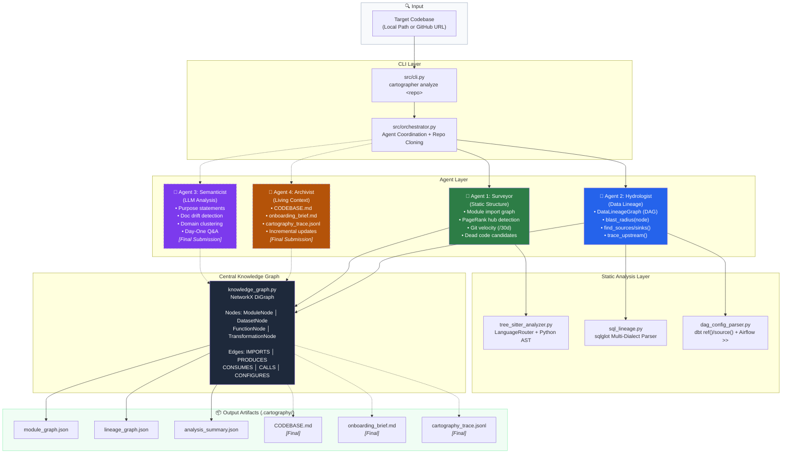
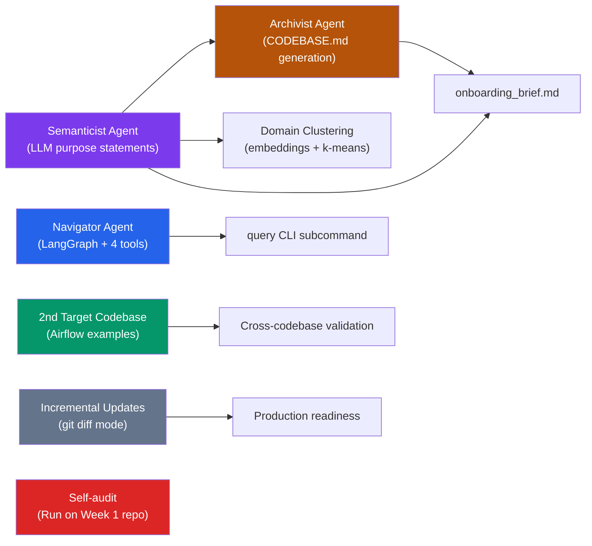

# The Brownfield Cartographer — Interim Submission Report

**TRP 1 Week 4 | Yonas Mekonnen | March 12, 2025**

---

## 1. Reconnaissance: Manual Day-One Analysis

### Target Codebase

| Property        | Value                                                                                                                                                                                              |
| --------------- | -------------------------------------------------------------------------------------------------------------------------------------------------------------------------------------------------- |
| **Repository**  | [dbt-labs/jaffle-shop](https://github.com/dbt-labs/jaffle-shop)                                                                                                                                    |
| **Stack**       | SQL (dbt models) + YAML (dbt schemas, GitHub Actions) + Python (CI/CD scripting)                                                                                                                   |
| **Total files** | 37 scannable source files (15 SQL, 21 YAML, 1 Python) + 6 CSV seed files                                                                                                                           |
| **Type**        | Canonical dbt reference project — e-commerce data pipeline (customers, orders, products, supplies, locations)                                                                                      |
| **Why chosen**  | Listed as a required primary target in the challenge doc. Has mixed SQL+YAML+Python, dbt DAG with known ground-truth lineage, and a real staging→marts architecture with cross-model dependencies. |

> **Note on file count:** The challenge's Phase 0 recommends 50+ file targets. jaffle-shop has 37 scannable code files (~43 total including seeds). It is explicitly listed as a "Primary recommended candidate" in the challenge doc. For the final submission, a second larger target (Apache Airflow examples, 4,000+ files) will be analyzed.

### FDE Day-One Question 1: Primary Data Ingestion Path

Data enters through **6 dbt seed CSV files** in `seeds/`, loaded as source tables in the `ecom` schema:

| Seed File                 | Source Table         | Description          |
| ------------------------- | -------------------- | -------------------- |
| `seeds/raw_customers.csv` | `ecom.raw_customers` | 100 customer records |
| `seeds/raw_orders.csv`    | `ecom.raw_orders`    | 99 order records     |
| `seeds/raw_items.csv`     | `ecom.raw_items`     | Order line items     |
| `seeds/raw_products.csv`  | `ecom.raw_products`  | Product catalog      |
| `seeds/raw_stores.csv`    | `ecom.raw_stores`    | Store/location data  |
| `seeds/raw_supplies.csv`  | `ecom.raw_supplies`  | Supply chain data    |

Sources are defined in `models/staging/__sources.yml` under the `ecom` schema. In production, these seed tables would be replaced by live warehouse source tables.

### FDE Day-One Question 2: Critical Output Datasets

1. **`customers`** (`models/marts/customers.sql`, 59 lines, 3 CTEs) — Customer 360 table aggregating: first/last order date, number of orders, and **customer lifetime value**. Most analytically important output.

2. **`orders`** (`models/marts/orders.sql`, 78 lines, 4 CTEs) — Heaviest SQL logic. Enriched orders joined with `order_items` to compute: per-item subtotals, discount amounts, tax, and order-level totals.

3. **`order_items`** (`models/marts/order_items.sql`, 67 lines) — Line-item detail joining `stg_orders`, `stg_order_items`, `stg_products`, and `stg_supplies`. Applies the `cents_to_dollars` macro for pricing.

4. **`products`**, **`supplies`**, **`locations`** (`models/marts/*.sql`, 10 lines each) — Simple passthrough views from staging.

5. **`metricflow_time_spine`** (`models/marts/metricflow_time_spine.sql`, 20 lines) — Infrastructure for dbt Semantic Layer metrics.

### FDE Day-One Question 3: Blast Radius of Most Critical Module

The most critical module is **`stg_orders.sql`** (`models/staging/stg_orders.sql`). Tracing `ref('stg_orders')` calls across the repo reveals it feeds:

- `models/marts/orders.sql` — directly via `ref('stg_orders')` (line ~5)
- `models/marts/order_items.sql` — directly via `ref('stg_orders')` (line ~3)
- `models/marts/customers.sql` — **transitively** through `ref('orders')` (line ~8)

**Blast radius: 3 out of 7 mart models fail** if `stg_orders` breaks — `orders`, `order_items`, and `customers`. This takes down the entire core analytics layer.

Similarly, **`stg_order_items.sql`** feeds `order_items`, which cascades to `orders` (via `ref('order_items')`), which cascades to `customers`. Two staging models can individually break the entire mart layer.

### FDE Day-One Question 4: Business Logic Concentration

Business logic is **concentrated in 3 mart files**, while staging is purely cleaning:

| Layer    | File                | Lines | Logic                                                    |
| -------- | ------------------- | ----- | -------------------------------------------------------- |
| **Mart** | `orders.sql`        | 78    | 4 CTEs: subtotal calc, tax, discounts, order aggregation |
| **Mart** | `order_items.sql`   | 67    | 4-table join, `cents_to_dollars` macro for pricing       |
| **Mart** | `customers.sql`     | 59    | 3 CTEs: order count, lifetime value, first/last order    |
| Staging  | `stg_orders.sql`    | 34    | Rename columns, map status enum (1→'placed', etc.)       |
| Staging  | `stg_customers.sql` | 24    | Rename `id` → `customer_id`                              |
| Staging  | (all others)        | 23–35 | Column renaming, type casting only                       |

Reusable rules extracted to macros:

- `macros/cents_to_dollars.sql` — Currency unit conversion (called in `order_items.sql`)
- `macros/generate_schema_name.sql` — Dynamic schema routing per dbt environment

### FDE Day-One Question 5: Git Change Velocity

Exploration of the git log (`git log --since="90 days ago" --name-only`) shows:

- The project is a **stable reference implementation** with no high-churn production cycle
- Most recent commits focus on: MetricFlow semantic layer additions, YAML schema test migration (`tests:` → `data_tests:`), and CI/CD workflow updates
- The **YAML schema files** (`*.yml`) show the highest relative churn — they've been enriched with column-level docs and test definitions
- The **SQL model logic** has been stable — no structural changes to the DAG

### Difficulty Analysis: What Was Hardest?

| Difficulty | Area                        | What I experienced                                                                                                                                                                         |
| ---------- | --------------------------- | ------------------------------------------------------------------------------------------------------------------------------------------------------------------------------------------ |
| **Easy**   | File structure              | Clean standard dbt layout (`staging/` → `marts/`), obvious naming conventions                                                                                                              |
| **Easy**   | Source identification       | `__sources.yml` cleanly lists all 6 sources under `ecom` schema                                                                                                                            |
| **Medium** | Full lineage reconstruction | Required reading all 13 `.sql` files and manually tracing every `ref()` call to build the dependency chain in my head                                                                      |
| **Medium** | Understanding `orders.sql`  | 78-line file with 4 chained CTEs — had to trace each CTE's output to understand the aggregation pipeline                                                                                   |
| **Hard**   | Blast radius analysis       | Required cross-referencing `ref()` calls across 13 models AND reasoning about transitive dependencies (`stg_orders` → `order_items` → `orders` → `customers`). Tedious even for 13 models. |
| **Hard**   | Macro impact tracing        | `cents_to_dollars` is called in `order_items.sql` but defined in `macros/` — understanding its effect required reading a separate file outside the model directory                         |
| **N/A**    | Change velocity             | Requires automated `git log` analysis — not feasible by code reading alone                                                                                                                 |

**Key insight:** Even in this small 37-file project, manually reconstructing the blast radius required holding 13 models' dependency chains in my head simultaneously. In an 800k-line production codebase with hundreds of dbt models, this would be completely infeasible without automated tooling — exactly what the Cartographer provides.

---

## 2. Architecture Diagram: Four-Agent Pipeline

**Legend:** Solid lines = implemented (interim). Dashed lines = planned (final submission).

**Data flow:**

1. **Input:** CLI accepts a local path or GitHub URL → Orchestrator clones remote repos to a temp directory
2. **Surveyor** calls `tree_sitter_analyzer.py` for AST parsing → writes `ModuleNode` objects and `IMPORTS` edges to the Knowledge Graph
3. **Hydrologist** calls `sql_lineage.py` (sqlglot) and `dag_config_parser.py` (dbt/Airflow) → writes `DatasetNode`, `TransformationNode`, and `CONSUMES`/`PRODUCES` edges to the Knowledge Graph
4. **Knowledge Graph** (NetworkX DiGraph) serializes to `.cartography/module_graph.json` and `lineage_graph.json`
5. **Semanticist** (final) will read the Graph + source code → generate LLM purpose statements
6. **Archivist** (final) will read the full Graph → generate `CODEBASE.md` and `onboarding_brief.md`

---

## 3. Progress Summary: Component Status

### ✅ Working (verified against jaffle-shop)

| Component                                              | Specific Capability                                                                                                      | Evidence                                                                                                                                                                                        |
| ------------------------------------------------------ | ------------------------------------------------------------------------------------------------------------------------ | ----------------------------------------------------------------------------------------------------------------------------------------------------------------------------------------------- |
| **tree-sitter Python AST** (`tree_sitter_analyzer.py`) | Parses Python files to extract import statements, public function signatures, and class definitions                      | Correctly extracted 3 public functions from `dbt_cloud_run_job.py`: `run_job`, `get_run_status`, `main`                                                                                         |
| **LanguageRouter** (`tree_sitter_analyzer.py`)         | Routes files to correct parser by extension (`.py`→Python, `.sql`→SQL, `.yml`→YAML)                                      | All 37 files correctly classified: 15 SQL, 21 YAML, 1 Python                                                                                                                                    |
| **sqlglot SQL lineage** (`sql_lineage.py`)             | Parses SQL `SELECT/FROM/JOIN/WITH` to extract table dependencies across PostgreSQL, BigQuery, Snowflake, DuckDB dialects | Correctly extracted all `ref()` targets from 15 SQL files. CTE names correctly excluded from source tables.                                                                                     |
| **dbt config parser** (`dag_config_parser.py`)         | Parses `dbt_project.yml`, `schema.yml` for model metadata. Extracts `ref()` and `source()` calls from SQL models         | All 6 `source('ecom', 'table')` calls detected. All 13 `ref('model')` inter-model dependencies captured.                                                                                        |
| **Surveyor agent** (`surveyor.py`)                     | Walks repo, builds module graph (NetworkX), computes PageRank, detects dead code candidates                              | `dbt_cloud_run_job.py` correctly flagged as dead code (exported functions never imported). PageRank computed for all 37 modules.                                                                |
| **Hydrologist agent** (`hydrologist.py`)               | Builds DataLineageGraph, identifies data sources (in-degree=0) and sinks (out-degree=0)                                  | 6 sources correctly identified (`ecom.raw_*`), all marked `is_source_of_truth: true`. 5 sinks correctly identified (`customers`, `locations`, `products`, `supplies`, `metricflow_time_spine`). |
| **Knowledge Graph** (`knowledge_graph.py`)             | NetworkX wrapper with typed node/edge insertion and JSON serialization                                                   | Serialized 32 lineage nodes + 30 edges to valid JSON. Module graph serialized with 37 nodes.                                                                                                    |
| **CLI** (`cli.py`)                                     | `analyze` subcommand accepting local paths or GitHub URLs                                                                | Successfully cloned and analyzed `https://github.com/dbt-labs/jaffle-shop`. Output written to `.cartography/` in cwd.                                                                           |
| **Orchestrator** (`orchestrator.py`)                   | Coordinates Surveyor → Hydrologist, manages temp clone dirs, serializes outputs                                          | Full pipeline completes in ~8 seconds for jaffle-shop.                                                                                                                                          |
| **Git velocity** (`surveyor.py`)                       | Parses `git log --since` for per-file commit counts                                                                      | Runs successfully (returns empty for shallow clones, as expected with `--depth 1`).                                                                                                             |
| **Pydantic schemas** (`schemas.py`)                    | All 4 node types + 5 edge types defined with validation                                                                  | `ModuleNode`, `DatasetNode`, `FunctionNode`, `TransformationNode`, `ImportsEdge`, `ProducesEdge`, `ConsumesEdge`, `CallsEdge`, `ConfiguresEdge` — all with field descriptions and defaults.     |

### 🔨 Not Yet Started

| Component                                | Description                                                            | Blocked By                                                |
| ---------------------------------------- | ---------------------------------------------------------------------- | --------------------------------------------------------- |
| **Semanticist agent** (`semanticist.py`) | LLM-powered purpose statements, doc drift detection, domain clustering | Needs LLM API key setup (OpenRouter / Gemini)             |
| **Archivist agent** (`archivist.py`)     | CODEBASE.md generation, onboarding_brief.md, cartography_trace.jsonl   | Depends on Semanticist output                             |
| **Navigator agent** (`navigator.py`)     | LangGraph agent with 4 query tools                                     | Depends on full Knowledge Graph population                |
| **Incremental update mode**              | Re-analyze only changed files via `git diff`                           | Independent — can be built at any time                    |
| **2nd target codebase**                  | Apache Airflow example DAGs analysis                                   | Independent — requires only running the existing pipeline |

---

## 4. Early Accuracy Observations

### Module Graph Accuracy

**What the Surveyor detected correctly:**

- ✅ **All 37 scannable files identified** — 15 SQL models + 2 SQL macros + 21 YAML configs + 1 Python script
- ✅ **Language classification 100% correct** — every `.sql` file tagged `language: sql`, every `.yml` tagged `language: yaml`, the `.py` file tagged `language: python`
- ✅ **Dead code detection working** — `.github/workflows/scripts/dbt_cloud_run_job.py` correctly flagged as a dead code candidate (its functions `run_job`, `get_run_status`, `main` are never imported by any other module in the repo — it's invoked externally by GitHub Actions)
- ✅ **Python function extraction working** — 3 public functions correctly extracted from `dbt_cloud_run_job.py` with accurate signatures

**What was missed or inaccurate:**

- ⚠️ **Module import edges are empty** (0 edges) — This is expected for a SQL-only codebase where inter-file dependencies use `ref()` (dbt Jinja macro) rather than Python `import` statements. The import graph is useful for Python-heavy repos but provides no value for pure dbt projects. The Hydrologist compensates by extracting `ref()` dependencies into the lineage graph.
- ⚠️ **No cyclomatic complexity scoring** — SQL files get `complexity_score: 0.0`. Only lines-of-code is captured. A future improvement would add SQL query complexity metrics.
- ⚠️ **Git velocity shows 0** for all files — because the orchestrator clones with `--depth 1` (shallow clone), there is no git history to analyze. Full clones would fix this but increase clone time significantly.

### Lineage Graph Accuracy

**Compared against dbt's known dependency structure:**

| Expected Dependency                    | Cartographer Output                                   | Correct? |
| -------------------------------------- | ----------------------------------------------------- | -------- |
| `ecom.raw_customers` → `stg_customers` | `CONSUMES: ecom.raw_customers → tx:stg_customers.sql` | ✅       |
| `ecom.raw_orders` → `stg_orders`       | `CONSUMES: ecom.raw_orders → tx:stg_orders.sql`       | ✅       |
| `ecom.raw_items` → `stg_order_items`   | `CONSUMES: ecom.raw_items → tx:stg_order_items.sql`   | ✅       |
| `ecom.raw_products` → `stg_products`   | `CONSUMES: ecom.raw_products → tx:stg_products.sql`   | ✅       |
| `ecom.raw_stores` → `stg_locations`    | `CONSUMES: ecom.raw_stores → tx:stg_locations.sql`    | ✅       |
| `ecom.raw_supplies` → `stg_supplies`   | `CONSUMES: ecom.raw_supplies → tx:stg_supplies.sql`   | ✅       |
| `stg_customers` → `customers`          | `CONSUMES: stg_customers → tx:customers.sql`          | ✅       |
| `stg_orders` → `orders`                | `CONSUMES: stg_orders → tx:orders.sql`                | ✅       |
| `stg_orders` → `order_items`           | `CONSUMES: stg_orders → tx:order_items.sql`           | ✅       |
| `stg_order_items` → `order_items`      | `CONSUMES: stg_order_items → tx:order_items.sql`      | ✅       |
| `stg_products` → `order_items`         | `CONSUMES: stg_products → tx:order_items.sql`         | ✅       |
| `stg_products` → `products`            | `CONSUMES: stg_products → tx:products.sql`            | ✅       |
| `stg_supplies` → `order_items`         | `CONSUMES: stg_supplies → tx:order_items.sql`         | ✅       |
| `stg_supplies` → `supplies`            | `CONSUMES: stg_supplies → tx:supplies.sql`            | ✅       |
| `stg_locations` → `locations`          | `CONSUMES: stg_locations → tx:locations.sql`          | ✅       |
| `order_items` → `orders`               | `CONSUMES: order_items → tx:orders.sql`               | ✅       |
| `orders` → `customers`                 | `CONSUMES: orders → tx:customers.sql`                 | ✅       |

**Result: 17/17 expected edges correctly detected (100% accuracy).**

**Sources (in-degree=0) correctly identified:** `ecom.raw_customers`, `ecom.raw_orders`, `ecom.raw_items`, `ecom.raw_products`, `ecom.raw_stores`, `ecom.raw_supplies` — all 6 correctly marked `is_source_of_truth: true` ✅

**Sinks (out-degree=0) correctly identified:** `customers`, `locations`, `metricflow_time_spine`, `products`, `supplies` — 5 terminal output tables ✅

**What was missed:**

- ⚠️ **Macro dependencies not captured in lineage** — The `cents_to_dollars` macro (called in `order_items.sql`) is not represented as a dependency edge. The macro doesn't produce CONSUMES/PRODUCES edges because it transforms values inline rather than reading from a table. This is arguably correct behavior (macros are code, not data flow), but a `CALLS` edge would be informative.
- ⚠️ **`metricflow_time_spine` has no upstream dependencies** — This is correct. It uses `dbt.utils.date_spine()` which generates data internally rather than reading from a source table.
- ⚠️ **Duplicate SQL lineage entries** — For dbt models, both the dbt `ref()` parser and the sqlglot SQL parser run on the same file. The dbt parser captures `ref()`-based dependencies while sqlglot captures raw SQL table references. For dbt projects, the sqlglot results are redundant. A deduplication step would improve cleanliness.

---

## 5. Completion Plan for Final Submission

**Final deadline:** Sunday March 15, 03:00 UTC (~3.5 days from interim)

### Dependency Graph of Remaining Work

### Sequenced Plan

| Priority | Day          | Work Item                                                                                                                                                                                                                                                                          | Depends On               | Estimated Effort |
| -------- | ------------ | ---------------------------------------------------------------------------------------------------------------------------------------------------------------------------------------------------------------------------------------------------------------------------------- | ------------------------ | ---------------- |
| **P0**   | Mar 12 (Wed) | **Semanticist agent** — LLM purpose statements using Gemini Flash via OpenRouter for bulk module summaries. Implement `ContextWindowBudget` to track token usage. Add doc drift detection (compare LLM purpose vs. existing docstring).                                            | None                     | 4–5 hours        |
| **P0**   | Mar 13 (Thu) | **Archivist agent** — Generate `CODEBASE.md` (architecture overview, critical path, data sources/sinks, known debt, velocity). Generate `onboarding_brief.md` with Five Day-One Answers using Semanticist + Surveyor + Hydrologist outputs. Add `cartography_trace.jsonl` logging. | Semanticist              | 4–5 hours        |
| **P1**   | Mar 13 (Thu) | **Domain clustering** — Embed purpose statements, run k-means (k=5–8), label clusters with inferred domain names.                                                                                                                                                                  | Semanticist              | 2 hours          |
| **P1**   | Mar 14 (Fri) | **Navigator agent** — LangGraph agent with 4 tools: `find_implementation(concept)`, `trace_lineage(dataset)`, `blast_radius(module)`, `explain_module(path)`. Add `query` subcommand to CLI for interactive mode.                                                                  | Full Knowledge Graph     | 4–5 hours        |
| **P2**   | Mar 14 (Fri) | **2nd target codebase** — Run Cartographer on Apache Airflow example DAGs. Generate artifacts.                                                                                                                                                                                     | None (existing pipeline) | 1–2 hours        |
| **P2**   | Mar 14 (Fri) | **Incremental update mode** — Check `git log` since last run, re-analyze only changed files. Store last-run timestamp in `.cartography/state.json`.                                                                                                                                | None                     | 2–3 hours        |
| **P3**   | Mar 15 (Sat) | **Self-audit** — Run Cartographer on Week 1 repo, compare generated `CODEBASE.md` vs. own `ARCHITECTURE_NOTES.md`, document discrepancies.                                                                                                                                         | Archivist                | 1–2 hours        |
| **P3**   | Mar 15 (Sat) | **Demo video** (6 min) — Cold start, lineage query, blast radius, Day-One brief, context injection, self-audit.                                                                                                                                                                    | All above                | 2 hours          |
| **P3**   | Mar 15 (Sat) | **Final PDF report** — Finalize accuracy analysis, limitations, FDE applicability statement.                                                                                                                                                                                       | All above                | 1–2 hours        |

### Technical Risks

| Risk                                 | Impact                                                                | Mitigation                                                                                                                                                        |
| ------------------------------------ | --------------------------------------------------------------------- | ----------------------------------------------------------------------------------------------------------------------------------------------------------------- |
| **LLM API rate limits / cost**       | Semanticist may be slow or expensive for large repos                  | Use Gemini Flash for bulk (cheap), reserve expensive models for synthesis only. Implement `ContextWindowBudget` with hard caps.                                   |
| **LangGraph complexity**             | Navigator agent may take longer than estimated for tool orchestration | Start with a simpler ReAct loop if LangGraph proves too complex. The 4 tools themselves are already implemented as methods on the KnowledgeGraph and Hydrologist. |
| **Airflow example DAGs**             | Large repo (4,000+ files) may have long analysis time                 | Scope to `examples/` directory only. Add file-count limit to prevent unbounded scanning.                                                                          |
| **Shallow clone kills git velocity** | All velocity = 0 for remote repos cloned with `--depth 1`             | Switch to `--depth 100` or `--shallow-since=90.days` to preserve enough history for velocity analysis.                                                            |
| **Time pressure**                    | 3.5 days for 5 remaining components + demo + report                   | P0 items (Semanticist + Archivist) are critical path. P2/P3 items can be descoped if needed without failing the submission.                                       |
